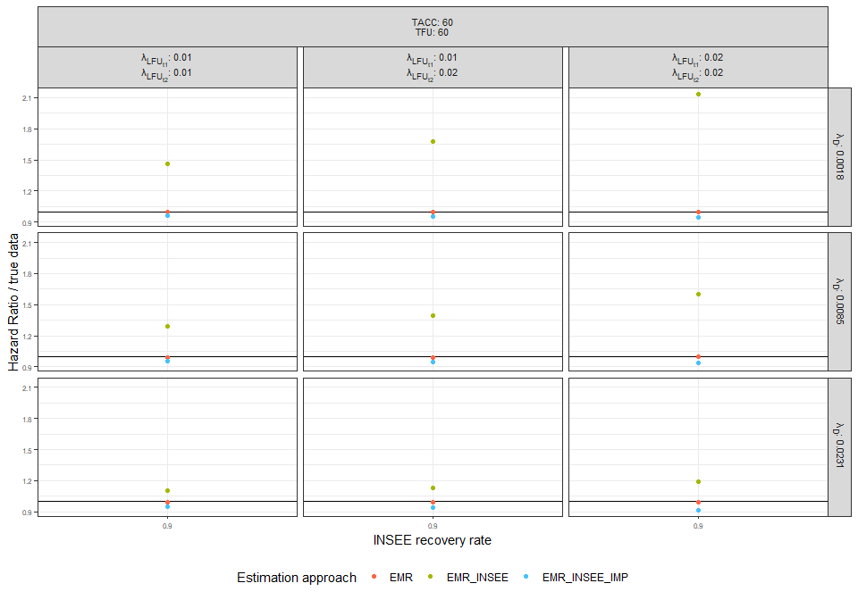
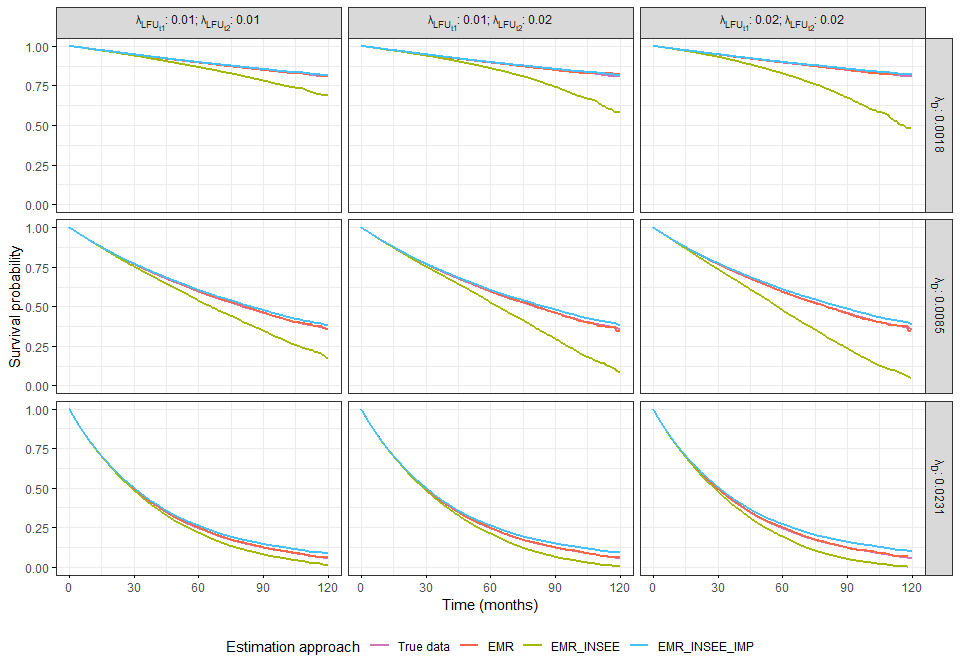
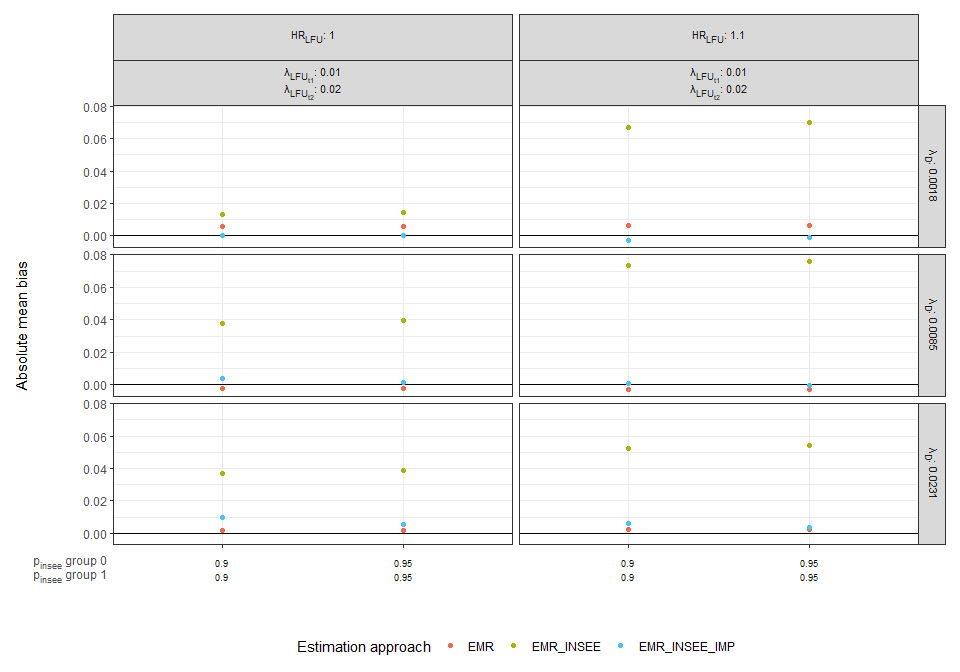
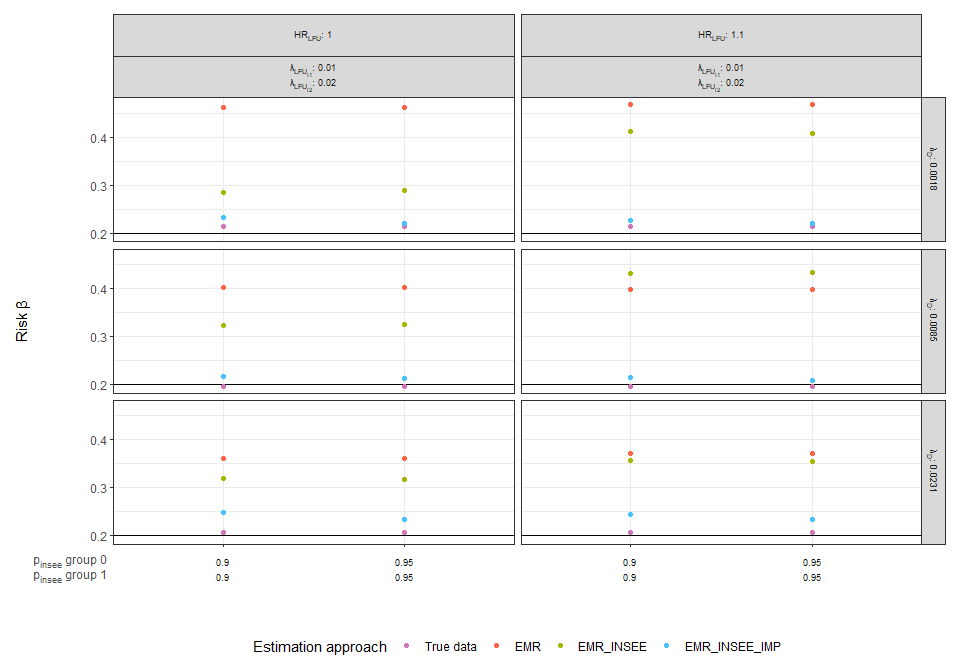
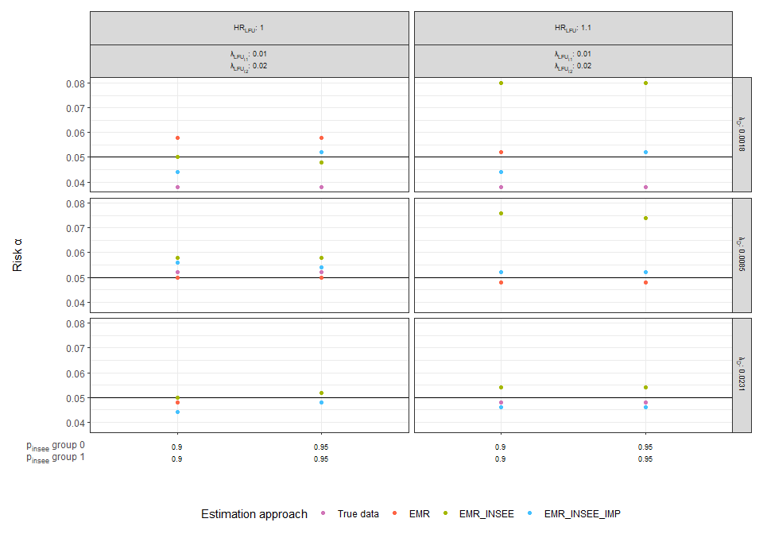

<!-- README.md is generated from README.Rmd. Please edit that file -->

# siminsee

<!-- badges: start -->
<!-- badges: end -->

The goal of Siminsee is to simulate survival trial data with censoring
under various scenarios using hospital and Institute of Statistics and
Economic Studies (INSEE) administrative data.

We considered here three approaches to estimate overall survival,
depending on the different sources of data that can provide information
on the patients’ vital status. The first approach, referred to below as
EMR, considers only vital status data obtained from the electronic
medical record (EMR), that is, hospital data. The second approach,
referred to as EMR_INSEE, adds vital status data supplied by the INSEE
to hospital data. In the third approach, referred to as EMR_INSEE_IMP,
an imputation of the vital status of patients whose death is not known
to the INSEE is added to the second approach, on the assumption that
these patients are alive on the date the INSEE file was queried.

## Installation

You can install the development version of siminsee as follows:

``` r
# install.packages("devtools")
devtools::install_github("Cleguillette/siminsee")
```

``` r
library(siminsee)
```

## Simulations

We use the “simulate_surv” function to simulate different scenarios with
parameters.

``` r
simulate_surv(scenario = 9, 
  nrepeat = rep(1, 9),
  nbp = rep(20000, 9),
  lambda_d = c(rep(0.001756009, 3), rep(0.008513760, 3), rep(0.02310490, 3)),
  hr = rep(1, 9),
  tacc = rep(60, 9),
  tfu = rep(60, 9),
  lambda_lfu1 = rep(c(0.01, 0.01, 0.02), 3),
  lambda_lfu2 = rep(c(0.01, 0.02, 0.02), 3),
  t_lfu2 = rep(36, 9),
  hr_lfu = rep(1, 9),
  pinsee0 = rep(0.9, 9),
  pinsee1 = rep(0.9, 9),
  seed = 2023)
#> $dat
#> # A tibble: 180,000 × 25
#>    scenario nrepeat    id gr    time_accrual fu_theo delevt_true evt_true
#>       <int>   <int> <int> <fct>        <dbl>   <dbl>       <dbl>    <dbl>
#>  1        1       1     1 0            0.003    120.       120.         0
#>  2        1       1     2 1            0.006    120.       120.         0
#>  3        1       1     3 0            0.009    120.       120.         0
#>  4        1       1     4 1            0.012    120.       120.         0
#>  5        1       1     5 0            0.015    120.       120.         0
#>  6        1       1     6 1            0.018    120.       120.         0
#>  7        1       1     7 0            0.021    120.        56.3        1
#>  8        1       1     8 1            0.024    120.       120.         0
#>  9        1       1     9 0            0.027    120.       120.         0
#> 10        1       1    10 1            0.03     120.       120.         0
#> # ℹ 179,990 more rows
#> # ℹ 17 more variables: lfu_true1 <dbl>, del_cens <dbl>, delevt_emr <dbl>,
#> #   evt_emr <dbl>, lfu_emr <dbl>, ea_emr <dbl>, info_insee <int>,
#> #   evt_insee <dbl>, evt_emr_insee <dbl>, delevt_emr_insee <dbl>,
#> #   lfu_emr_insee <dbl>, ea_emr_insee <dbl>, delevt_emr_insee_imp <dbl>,
#> #   evt_emr_insee_imp <dbl>, lfu_emr_insee_imp <dbl>, ea_emr_insee_imp <dbl>,
#> #   imm_emr_insee_imp <dbl>
#> 
#> $parameters
#> # A tibble: 9 × 13
#>   scenario nrepeat   nbp  tacc   tfu lambda_d    hr lambda_lfu1 lambda_lfu2
#>      <int>   <dbl> <dbl> <dbl> <dbl>    <dbl> <dbl>       <dbl>       <dbl>
#> 1        1       1 20000    60    60  0.00176     1        0.01        0.01
#> 2        2       1 20000    60    60  0.00176     1        0.01        0.02
#> 3        3       1 20000    60    60  0.00176     1        0.02        0.02
#> 4        4       1 20000    60    60  0.00851     1        0.01        0.01
#> 5        5       1 20000    60    60  0.00851     1        0.01        0.02
#> 6        6       1 20000    60    60  0.00851     1        0.02        0.02
#> 7        7       1 20000    60    60  0.0231      1        0.01        0.01
#> 8        8       1 20000    60    60  0.0231      1        0.01        0.02
#> 9        9       1 20000    60    60  0.0231      1        0.02        0.02
#> # ℹ 4 more variables: t_lfu2 <dbl>, hr_lfu <dbl>, pinsee0 <dbl>, pinsee1 <dbl>
```

## Analyses

### Comparison of estimation approach

We use the ‘summarize_outcomes’ function to calculate the proportions of
patients who experienced events, patients who were lost to follow-up,
patients who were excluded alive, or immortal patients according to the
estimation approach (EMR, EMR_INSEE and EMR_INSEE_IMP) for each
repetition of each scenario of the simulated data.

``` r
sim <- simulate_surv(scenario = 9, 
  nrepeat = rep(1, 9),
  nbp = rep(20000, 9),
  lambda_d = c(rep(0.001756009, 3), rep(0.008513760, 3), rep(0.02310490, 3)),
  hr = rep(1, 9),
  tacc = rep(60, 9),
  tfu = rep(60, 9),
  lambda_lfu1 = rep(c(0.01, 0.01, 0.02), 3),
  lambda_lfu2 = rep(c(0.01, 0.02, 0.02), 3),
  t_lfu2 = rep(36, 9),
  hr_lfu = rep(1, 9),
  pinsee0 = rep(0.9, 9),
  pinsee1 = rep(0.9, 9),
  seed = 2023)

summarize_outcomes(sim)
#> $result
#> # A tibble: 9 × 13
#>   scenario nrepeat p_evt_true p_evt_emr p_lfu_emr p_ea_emr p_evt_emr_insee
#>      <int>   <int>      <dbl>     <dbl>     <dbl>    <dbl>           <dbl>
#> 1        1       1      0.150    0.0991     0.550   0.351            0.145
#> 2        2       1      0.150    0.0896     0.695   0.215            0.144
#> 3        3       1      0.150    0.0699     0.781   0.150            0.142
#> 4        4       1      0.536    0.370      0.433   0.197            0.519
#> 5        5       1      0.536    0.342      0.537   0.121            0.516
#> 6        6       1      0.536    0.276      0.640   0.0840           0.510
#> 7        7       1      0.869    0.657      0.284   0.0588           0.846
#> 8        8       1      0.869    0.63       0.332   0.0376           0.843
#> 9        9       1      0.869    0.521      0.454   0.0257           0.833
#> # ℹ 6 more variables: p_lfu_emr_insee <dbl>, p_ea_emr_insee <dbl>,
#> #   p_evt_emr_insee_imp <dbl>, p_lfu_emr_insee_imp <dbl>,
#> #   p_ea_emr_insee_imp <dbl>, p_imm_emr_insee_imp <dbl>
#> 
#> $parameters
#> # A tibble: 9 × 13
#>   scenario nrepeat   nbp  tacc   tfu lambda_d    hr lambda_lfu1 lambda_lfu2
#>      <int>   <dbl> <dbl> <dbl> <dbl>    <dbl> <dbl>       <dbl>       <dbl>
#> 1        1       1 20000    60    60  0.00176     1        0.01        0.01
#> 2        2       1 20000    60    60  0.00176     1        0.01        0.02
#> 3        3       1 20000    60    60  0.00176     1        0.02        0.02
#> 4        4       1 20000    60    60  0.00851     1        0.01        0.01
#> 5        5       1 20000    60    60  0.00851     1        0.01        0.02
#> 6        6       1 20000    60    60  0.00851     1        0.02        0.02
#> 7        7       1 20000    60    60  0.0231      1        0.01        0.01
#> 8        8       1 20000    60    60  0.0231      1        0.01        0.02
#> 9        9       1 20000    60    60  0.0231      1        0.02        0.02
#> # ℹ 4 more variables: t_lfu2 <dbl>, hr_lfu <dbl>, pinsee0 <dbl>, pinsee1 <dbl>
```

We use the ‘estimate_approach1’ function to perform Cox model analyses
of the simulated data to compare the estimation approaches (EMR,
EMR_INSEE and EMR_INSEE_IMP). This function returns the hazard ratios by
comparing the estimations from each approach with an estimation based on
the true data in each scenario and repetition.

This function should be used when all patients are in the same group
(‘hr’ in the ‘simulate_surv’ function should be equal to 1).

``` r
estimate_approach1(sim)
#> $result
#> # A tibble: 9 × 5
#>   scenario nrepeat hr_emr hr_emr_insee hr_emr_insee_imp
#>      <dbl>   <dbl>  <dbl>        <dbl>            <dbl>
#> 1        1       1  0.997         1.46            0.963
#> 2        2       1  0.998         1.68            0.955
#> 3        3       1  0.994         2.13            0.945
#> 4        4       1  0.991         1.29            0.957
#> 5        5       1  0.993         1.40            0.951
#> 6        6       1  1.00          1.60            0.936
#> 7        7       1  0.992         1.10            0.948
#> 8        8       1  0.994         1.13            0.943
#> 9        9       1  0.990         1.19            0.918
#> 
#> $parameters
#> # A tibble: 9 × 13
#>   scenario nrepeat   nbp  tacc   tfu lambda_d    hr lambda_lfu1 lambda_lfu2
#>      <int>   <dbl> <dbl> <dbl> <dbl>    <dbl> <dbl>       <dbl>       <dbl>
#> 1        1       1 20000    60    60  0.00176     1        0.01        0.01
#> 2        2       1 20000    60    60  0.00176     1        0.01        0.02
#> 3        3       1 20000    60    60  0.00176     1        0.02        0.02
#> 4        4       1 20000    60    60  0.00851     1        0.01        0.01
#> 5        5       1 20000    60    60  0.00851     1        0.01        0.02
#> 6        6       1 20000    60    60  0.00851     1        0.02        0.02
#> 7        7       1 20000    60    60  0.0231      1        0.01        0.01
#> 8        8       1 20000    60    60  0.0231      1        0.01        0.02
#> 9        9       1 20000    60    60  0.0231      1        0.02        0.02
#> # ℹ 4 more variables: t_lfu2 <dbl>, hr_lfu <dbl>, pinsee0 <dbl>, pinsee1 <dbl>
```

We use the ‘plot_hr1’ function to plot hazard ratios comparing the
estimations from each approach (EMR, EMR_INSEE and EMR_INSEE_IMP) with
the estimation based on the “true” data in each simulated scenario.

This function should be used when all patients are in the same group
(‘hr’ in the ‘simulate_surv’ function should be equal to 1) with a
single repetition for each scenario.

``` r
res <- estimate_approach1(sim)
plot_hr1(res)
```



We use the ‘plot_surv1’ function to plot Kaplan-Meier survival curves
according to the estimation approach (EMR, EMR_INSEE and EMR_INSEE_IMP)
for the simulated scenarios.

This function should be used when all patients are in the same group
(‘hr’ in the ‘simulate_surv’ function should be equal to 1) with a
single repetition for each scenario.

``` r
sim <- simulate_surv(scenario = 9, 
                  nrepeat = rep(1, 9),
                  nbp = rep(20000, 9),
                  lambda_d = c(rep(0.001756009, 3), rep(0.008513760, 3), rep(0.02310490, 3)),
                  hr = rep(1, 9),
                  tacc = rep(60, 9),
                  tfu = rep(60, 9),
                  lambda_lfu1 = rep(c(0.01, 0.01, 0.02), 3),
                  lambda_lfu2 = rep(c(0.01, 0.02, 0.02), 3),
                  t_lfu2 = rep(36, 9),
                  hr_lfu = rep(1, 9),
                  pinsee0 = rep(0.9, 9),
                  pinsee1 =rep(0.9, 9),
                  seed = 2023)

plot_surv1(sim)
```



### Comparison of two groups

We use the ‘estimate_approach2’ function to perform Cox model analyses
of the simulated data to compare the two groups (of identical size and
homogeneous recruitment over time). The function returns the results of
the analyses according to the three estimation approaches (EMR,
EMR_INSEE and EMR_INSEE_IMP) for each scenario and repetition.

``` r
sim <- simulate_surv(scenario = 12,
                  nrepeat = rep(500, 12),
                  nbp = c(rep(1974, 4), rep(525, 4), rep(305, 4)),
                  lambda_d = c(rep(0.001756009, 4), rep(0.008513760, 4), rep(0.02310490, 4)),
                  hr = rep(0.7, 12),
                  tacc =  rep(60, 12),
                  tfu =   rep(60, 12),
                  lambda_lfu1 = rep(0.01, 12),
                  lambda_lfu2 = rep(0.02, 12),
                  t_lfu2 = rep(36, 12),
                  hr_lfu = rep(c(rep(1, 2), rep(1.1, 2)), 3),
                  pinsee0 = rep(c(0.9, 0.95), 6),
                  pinsee1 = rep(c(0.9, 0.95), 6),
                  seed = 2023)
estimate_approach2(sim)
#> $result
#> # A tibble: 6,000 × 30
#>    scenario nrepeat log_hr_true hr_true waldtest_true pval_test_true
#>       <dbl>   <dbl>       <dbl>   <dbl>         <dbl>          <dbl>
#>  1        1       1      -0.287   0.751          4.75       0.0293  
#>  2        1       2      -0.266   0.766          4.73       0.0296  
#>  3        1       3      -0.379   0.684          9.89       0.00166 
#>  4        1       4      -0.342   0.711          6.66       0.00985 
#>  5        1       5      -0.323   0.724          6.59       0.0103  
#>  6        1       6      -0.367   0.692          8.66       0.00325 
#>  7        1       7      -0.380   0.684          8.16       0.00428 
#>  8        1       8      -0.338   0.713          6.64       0.00996 
#>  9        1       9      -0.483   0.617         14.3        0.000158
#> 10        1      10      -0.240   0.787          3.34       0.0678  
#> # ℹ 5,990 more rows
#> # ℹ 24 more variables: success_uni_cox_true <dbl>, failure_cox_true <dbl>,
#> #   success_bi_cox_true <dbl>, log_hr_emr <dbl>, hr_emr <dbl>,
#> #   waldtest_emr <dbl>, pval_test_emr <dbl>, success_uni_cox_emr <dbl>,
#> #   failure_cox_emr <dbl>, success_bi_cox_emr <dbl>, log_hr_emr_insee <dbl>,
#> #   hr_emr_insee <dbl>, waldtest_emr_insee <dbl>, pval_test_emr_insee <dbl>,
#> #   success_uni_cox_emr_insee <dbl>, failure_cox_emr_insee <dbl>, …
#> 
#> $parameters
#> # A tibble: 12 × 13
#>    scenario nrepeat   nbp  tacc   tfu lambda_d    hr lambda_lfu1 lambda_lfu2
#>       <int>   <dbl> <dbl> <dbl> <dbl>    <dbl> <dbl>       <dbl>       <dbl>
#>  1        1     500  1974    60    60  0.00176   0.7        0.01        0.02
#>  2        2     500  1974    60    60  0.00176   0.7        0.01        0.02
#>  3        3     500  1974    60    60  0.00176   0.7        0.01        0.02
#>  4        4     500  1974    60    60  0.00176   0.7        0.01        0.02
#>  5        5     500   525    60    60  0.00851   0.7        0.01        0.02
#>  6        6     500   525    60    60  0.00851   0.7        0.01        0.02
#>  7        7     500   525    60    60  0.00851   0.7        0.01        0.02
#>  8        8     500   525    60    60  0.00851   0.7        0.01        0.02
#>  9        9     500   305    60    60  0.0231    0.7        0.01        0.02
#> 10       10     500   305    60    60  0.0231    0.7        0.01        0.02
#> 11       11     500   305    60    60  0.0231    0.7        0.01        0.02
#> 12       12     500   305    60    60  0.0231    0.7        0.01        0.02
#> # ℹ 4 more variables: t_lfu2 <dbl>, hr_lfu <dbl>, pinsee0 <dbl>, pinsee1 <dbl>
```

We use the ‘calc_mean_coeff2’ function to obtain mean estimations of the
coefficients of the Cox modeling of repetitions for each scenario
according to the three estimation approaches (EMR, EMR_INSEE and
EMR_INSEE_IMP).

``` r
res <- estimate_approach2(sim) 
calc_mean_coeff2(res)
#> $result
#> # A tibble: 12 × 28
#>    scenario nrepeat exp_m_log_hr_true m_log_hr_true p_suc_uni_true p_suc_bi_true
#>       <dbl>   <dbl>             <dbl>         <dbl>          <dbl>         <dbl>
#>  1        1     500             0.702        -0.354          0.786         0.786
#>  2        2     500             0.702        -0.354          0.786         0.786
#>  3        3     500             0.702        -0.354          0.786         0.786
#>  4        4     500             0.702        -0.354          0.786         0.786
#>  5        5     500             0.700        -0.356          0.804         0.804
#>  6        6     500             0.700        -0.356          0.804         0.804
#>  7        7     500             0.700        -0.356          0.804         0.804
#>  8        8     500             0.700        -0.356          0.804         0.804
#>  9        9     500             0.701        -0.355          0.794         0.794
#> 10       10     500             0.701        -0.355          0.794         0.794
#> 11       11     500             0.701        -0.355          0.794         0.794
#> 12       12     500             0.701        -0.355          0.794         0.794
#> # ℹ 22 more variables: p_fail_true <dbl>, exp_m_log_hr_emr <dbl>,
#> #   m_log_hr_emr <dbl>, bias_abs_emr <dbl>, bias_rel_emr <dbl>,
#> #   p_suc_uni_emr <dbl>, p_suc_bi_emr <dbl>, p_fail_emr <dbl>,
#> #   exp_m_log_hr_emr_insee <dbl>, m_log_hr_emr_insee <dbl>,
#> #   bias_abs_emr_insee <dbl>, bias_rel_emr_insee <dbl>,
#> #   p_suc_uni_emr_insee <dbl>, p_suc_bi_emr_insee <dbl>,
#> #   p_fail_emr_insee <dbl>, exp_m_log_hr_emr_insee_imp <dbl>, …
#> 
#> $parameters
#> # A tibble: 12 × 13
#>    scenario nrepeat   nbp  tacc   tfu lambda_d    hr lambda_lfu1 lambda_lfu2
#>       <int>   <dbl> <dbl> <dbl> <dbl>    <dbl> <dbl>       <dbl>       <dbl>
#>  1        1     500  1974    60    60  0.00176   0.7        0.01        0.02
#>  2        2     500  1974    60    60  0.00176   0.7        0.01        0.02
#>  3        3     500  1974    60    60  0.00176   0.7        0.01        0.02
#>  4        4     500  1974    60    60  0.00176   0.7        0.01        0.02
#>  5        5     500   525    60    60  0.00851   0.7        0.01        0.02
#>  6        6     500   525    60    60  0.00851   0.7        0.01        0.02
#>  7        7     500   525    60    60  0.00851   0.7        0.01        0.02
#>  8        8     500   525    60    60  0.00851   0.7        0.01        0.02
#>  9        9     500   305    60    60  0.0231    0.7        0.01        0.02
#> 10       10     500   305    60    60  0.0231    0.7        0.01        0.02
#> 11       11     500   305    60    60  0.0231    0.7        0.01        0.02
#> 12       12     500   305    60    60  0.0231    0.7        0.01        0.02
#> # ℹ 4 more variables: t_lfu2 <dbl>, hr_lfu <dbl>, pinsee0 <dbl>, pinsee1 <dbl>
```

We use the ‘plot_bias2’ function to plot the mean absolute biases in the
repetitions for each scenario according to the three estimation
approaches (EMR, EMR_INSEE and EMR_INSEE_IMP).

This function should be used when there is a difference in survival
between the two groups (‘hr’ in the ‘simulate_surv’ function should not
be equal to 1).

``` r
mean_res <- calc_mean_coeff2(res) 
plot_bias2(mean_res)
```



We use the ‘plot_beta2’ function to plot the $\beta$ risk calculated for
the repetitions in each scenario according to the three estimation
approaches (EMR, EMR_INSEE and EMR_INSEE_IMP).

This function should be used when there is a difference in survival
between the two groups (‘hr’ in the ‘simulate_surv’ function should not
be equal to 1).

``` r
plot_beta2(mean_res)
```



We use the ‘plot_alpha2’ function to plot the $\alpha$ risk calculated
for the repetitions in each scenario according to the three estimation
approaches (EMR, EMR_INSEE and EMR_INSEE_IMP).

This function should be used when there is no difference in survival
between the two groups (‘hr’ in the ‘simulate_surv’ function should be
equal to 1).

``` r
sim <- simulate_surv(scenario = 12,
                  nrepeat = rep(500, 12),
                  nbp = c(rep(1974, 4), rep(525, 4), rep(305, 4)),
                  lambda_d = c(rep(0.001756009, 4), rep(0.008513760, 4), rep(0.02310490, 4)),
                  hr = rep(1, 12),
                  tacc =  rep(60, 12),
                  tfu =   rep(60, 12),
                  lambda_lfu1 = rep(0.01, 12),
                  lambda_lfu2 = rep(0.02, 12),
                  t_lfu2 = rep(36, 12),
                  hr_lfu = rep(c(rep(1, 2), rep(1.1, 2)), 3),
                  pinsee0 = rep(c(0.9, 0.95), 6),
                  pinsee1 = rep(c(0.9, 0.95), 6),
                  seed = 2023)

res <- estimate_approach2(sim) 

mean_res <- calc_mean_coeff2(res)

plot_alpha2(mean_res)
```


